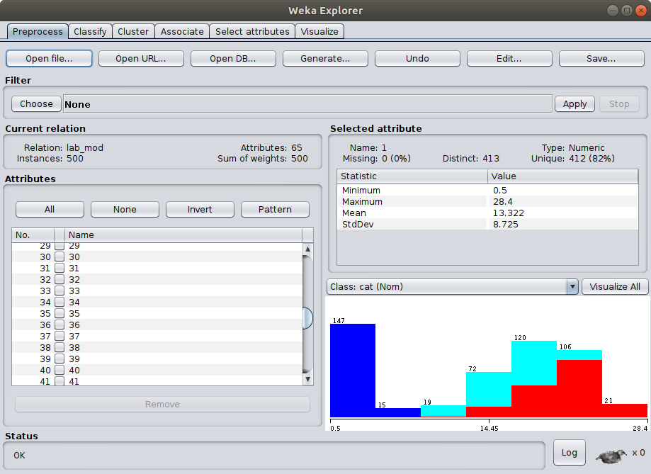
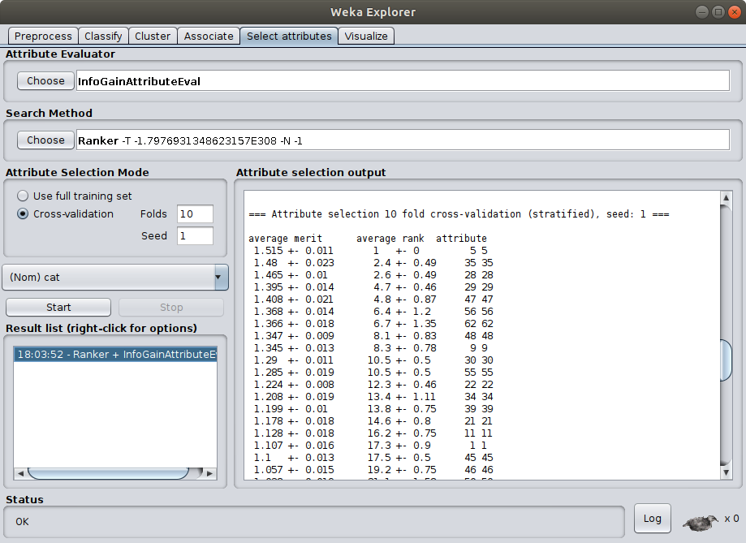
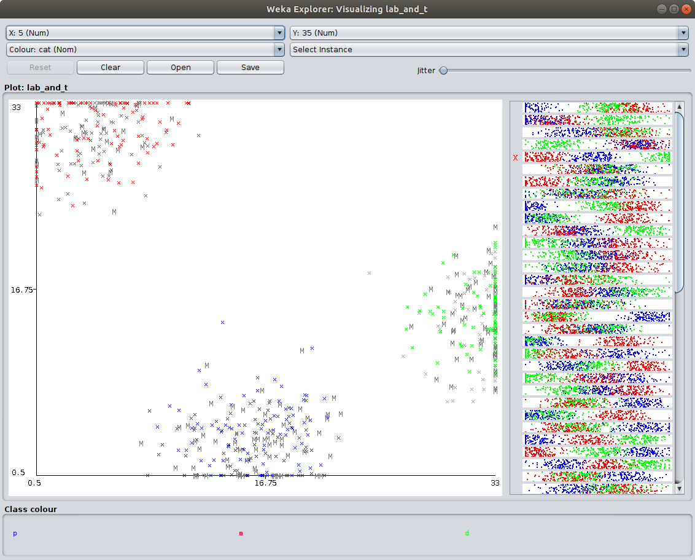

# Virtual Machine Monitor UWU

### Description
Virtual Machine Monitor UWU
998

A botnet has infected your computer. By examining the URL of its command and control server, you've discovered that your backup server is co-resident with the command and control server. You decided to prime and probe the instruction set cache of the VM to determine the botnets secret key and shut it down. You now have a collection of cache vectors representing the response time of the shared instruction cache. Your goal is to determine the key. Luckily, your hosting provider is antiquated and the botnet VM doesn't alternate between cores so you could continuously monitor it. You also know that the victim VM uses the exponent by squaring algorithm in cryptographic operations with the key.

```
int mult(int x, int y) { return x * y; }

int div(int x, int y) { return x / y; }

int exp_by_squaring(int x, int n) {
  if (n == 0) {
    return 1;
  }
  int y = 1;
  while (n > 1) {
    if (n % 2 == 1) {
      x = pow(x, 2);
      n = div(n, 2);
    } else {
      y = mult(x, y);
      x = pow(x, 2);
      n = div((n - 1), 2);
    }
  }
  return x * y;
}
```

In your lab, you ran the same hardware as the target VM with a similar software stack. You used the same prime and probe technique to label cache vectors P, D, M referring to when the functions pow, div, mult were running. Below are the datasets from the machines.

target.csv

lab.csv

The flag is the n parameter of exp_by_squaring used by the victim VM in binary.

-- a1c3

### Analysis

The descriptions tells us about a botnet C&C server which runs on the same server as our machine. So, it was possible to acquire two datasets which resemble instruction cache data:
1. **lab.csv**: Recorded vectors of own machine. Each row has 64 floating point features and one class feature, which can be `m`, `p` or `d`.
2. **target.csv**: Recorded vectors of C&C machine. Has the same set of features but lacks the classification column.
In this scenario, the classes resemble the specific arithmetic operations **m**ultiply, **d**ivision and **p**ower which are used in the `exp_by_squaring` function. 

The goal is to find the value of `n` used in the `exp_by_squaring` function. Each operation has its own unique response time fingerprint. If we can acquire the sequence of operations from **target.csv**, then we can use this set to reverse the bits of `n`, one-by-one. A sequence of `m p d` operations indicate a 0 bit and `p d` tells us that the bit was 1.

This setting is a classical data science scenario: We have a training dataset with feature vectors and classification and a test dataset with the same amount of features per entry but without classification. Our goal is to use the training set to train a classifier model and apply it on the test set to assign classes to it.

#### Classify the data of target.csv
Several tools and frameworks are available to build and train a classifier model. I chose to a semi-automatic approach with the ML tool [weka](http://old-www.cms.waikato.ac.nz/~ml/weka/index.html) and python. Before loading data into weka, 


* **Inspect the dataset**:
Make sure you have added a row on top to name each column. Otherwise weka refuses to accept the dataset. To load the lab.csv into weka, open the *Explorer*, click *Open file ...*, select the csv file and click *Open*.


* **Evaluate and select features**
Change to column *Select attributes*. Change the attribute evaluator to the desired method (I chose *InfoGainAttributeEval*). Acknowledge the ranker message with *yes*. On the left side, choose *Cross-validation* as the selection mode and in the drop-down menu below, choose the last entry as class attribute (*cat* in my case). Click *Start*. In the window on the right, we can see the output of the selection process. With this evaluation method, the attributes of column 5 and 35 have the biggest merit.


* **Construct a classifier based on decision rules**
First we check our results by visualizing the whole data set (lab + target) with respect of the attributes 5 and 35, and its classes m, p, d:
Append the target vectors to the lab vectors and insert a `?` in the class column so signal weka an unknown class. Load the csv as described in 1. Click on the column *Visualize*. In the settings below the plot matrix, click *Select Attributes*. Select the attributes 5 and 35 and click *OK* and then *Update*. Left-click on the top-left picture in the plot matrix to open it in a separate window.

It shows a plot with attribute 5 as x-axis and attribute 35 as y-axis. `p`, `m` and `d` vectors are colorized in blue, red and green respectively. Additionally, all unclassified target vectors are indicated as gray `M` symbols. The picture perfectly visualized the the three clusters of each class. All unclassified data correlate with the clusters and both attributes are sufficient to correctly classify the data. 
Decision-rule-based classifiers means, that we have a set of relational decisions (`<`, `<=`, `>`, `>=`) in a tree structure to classify data.
In our example, we set up two rules:
  1. `v[5] >= 24.75` to check if the data point `v` is within the `d` class or not
  2. `v[35] >= 16.75` to check if `v` is in class `m` or `p`.
The advantage of such decision-based classifiers is, that they are simple and fast. On the other hand, they might fail to handle more complex data sets with mixing clusters.
The classification function is:
```python
def classify_attr_5_35(dat):
    classes = []
    for v in dat:
        if v[5] >= 24.75:  # rule based on attribute 5
            classes.append("d")  # division operation
        else:
            if v[35] >= 16.75:    # rule based on attribute 35
                classes.append("m")  # multiplication operation
            else:
                classes.append("p")  # power operation
    return classes
```

* **Classify the target data with python**
With the function at hand, we now can move on to classify the target dataset.

```python
def read_dataset(file_path):
    dat = []
    with open(file_path) as csvfile:
        rdr = csv.reader(csvfile, delimiter=',')
        for row in rdr:
            dat.append(dict([(i + 1, float(row[i])) for i in range(len(row))]))
    return dat

dat = read_dataset("target.csv")
op_seq = classify_attr_5_35(dat)  # returns the sequence of operations
```
We read in all vectors of the target dataset and stick them into the classifier. This yields a sequence of operations.

* **Reconstruct `n` from sequence of operations**
Our goal is to get the variable `n` of the target machine. We know that `n` is used in the algorithm `exp_by_squaring` from which we collected the data. The algorithm checks each bit of `n` and executes a number of operations, based on it. This means, that the sequence `m p d` reflects a 0 bit and `p d` a 1 bit of the variable `n`. By chunking the sequence of operations into `m p d` and `p d` we are able to directly reconstruct the variable `n`:
```python
def seq_to_n(seq):
    f = []
    while len(seq) > 0:
        if seq[0] == 'm':
            assert(seq[1] == 'p' and seq[2] == 'd')
            f.append(0)  # bit 0
            seq = seq[3:]

        elif seq[0] == 'p':
            assert(seq[1] == 'd')
            f.append(1)  # bit 1
            seq = seq[2:]

        else:
            assert(False)  # invalid operation combo
    return list(reversed(f))
```
**BUT WAIT!** There is a small catch to this. Inspecting the function `exp_by_squaring` reveals, the operation `n - 1` in case the bit of `n` is 0. This means that the next `n` in the loop is different and it's not just a simple logical shift to the right. This means that in the case of a 0, we compute `(n + 1) * 2` to correctly reverse the operation. Another small detail (which I think wasn't intended by the author) is that the last bit of `n` after executing the function, can be either 0 or 1 and the information gets lost. In other words: When reconstruction `n` from the sequence, we don't know if the starting value is 0 or 1! But there are only these two options, so we simply compute both variants.

Putting it all together:
```python
def classify_attr_5_35(dat):
    classes = []
    for v in dat:
        if v[5] >= 24.75:  # rule based on attribute 5
            classes.append("d")  # division operation
        else:
            if v[35] >= 16.75:    # rule based on attribute 35
                classes.append("m")  # multiplication operation
            else:
                classes.append("p")  # power operation
    return classes

def read_dataset(file_path):
    dat = []
    with open(file_path) as csvfile:
        rdr = csv.reader(csvfile, delimiter=',')
        for row in rdr:
            dat.append(dict([(i + 1, float(row[i])) for i in range(len(row))]))
    return dat

def seq_to_n(seq, n_start):
    f = []
    while len(seq) > 0:
        if seq[0] == 'm':
            assert(seq[1] == 'p' and seq[2] == 'd')
            f.append(0)
            seq = seq[3:]

        elif seq[0] == 'p':
            assert(seq[1] == 'd')
            f.append(1)
            seq = seq[2:]

        else:
            assert(False)
    n = n_start
    
    for b in list(reversed(f)):
        if b == 0:
            n = (n + 1) * 2
        else:
            n = n * 2 + 1
    return n

dat = read_dataset("target.csv")
op_seq = classify_attr_5_35(dat)  # returns the sequence of operations
print(bin(seq_to_n(op_seq, 0)))
print(bin(seq_to_n(op_seq, 1)))
```
Here, 1 is the correct starting value which yiels the value `0b100101010011101000100010111101001001100001101001010010001011011111`

So the flag is:
`utflag{100101010011101000100010111101001001100001101001010010001011011111}`


