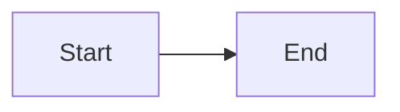

# File.tetr

### Description: 
"I really like tetris. I made a top secret opener and encoded it with my custom encoding scheme.
I hope no one finds my opener..
Put the opener into https://harddrop.com/fumen/ to find the secret part of the flag. The flag is utflag{v115@???????????}."

Within the provided archive there is a binary file `encoder`, three times the combination of a `.gif` and `.tetr` file and a `secret.tetr` file.

### Analysis

We can execute the binary which yields a binary file `output.tetr`. Using `xxd output.tetr` reveals no flag unfortunately.
We analyze the executable with ghidra.   

Basically, the input is a string which encodes a number of Tetris game states (more info: https://github.com/knewjade/tetris-fumen). 

